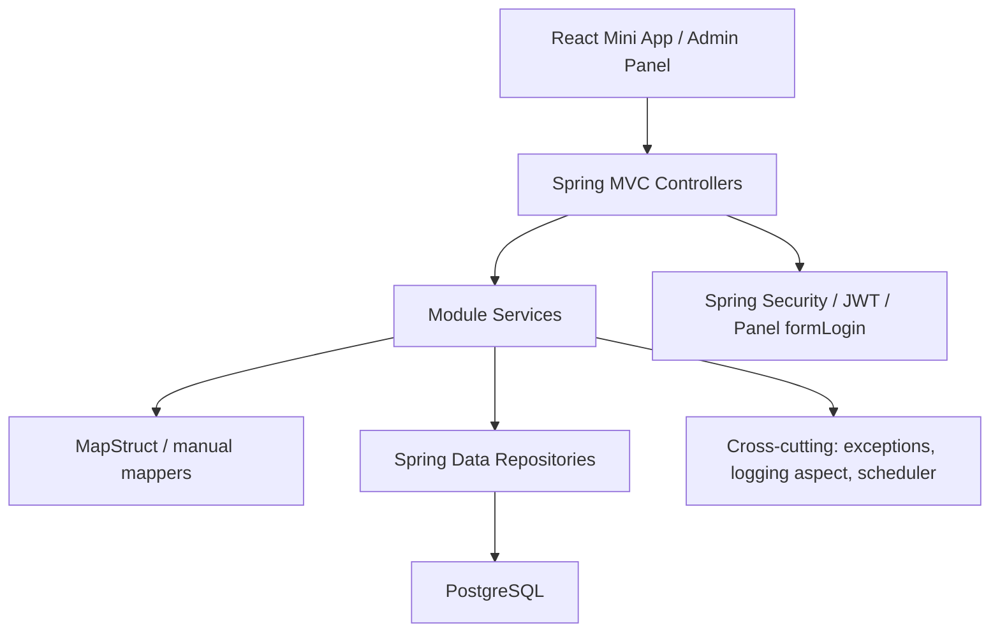

# Round13

`Round13` — монорепозиторий клуба единоборств с двумя основными частями:

- `backend`: Spring Boot API для Telegram Mini App, административных сценариев, расписания, событий, магазина и статистики;
- `frontend`: React/Vite клиент для Mini App и отдельного web-интерфейса админ-панели.

Проект покрывает несколько доменов сразу:

- Telegram-аутентификацию и JWT-сессии;
- профиль участника и онбординг;
- список участников клуба и карточки бойцов/тренеров;
- события клуба и тренировочную афишу;
- персональные тренировки тренера с учениками;
- магазин мерча и тренировочных пакетов;
- внутреннюю admin API;
- отдельную admin panel с логином/ролями;
- пользовательскую статистику и кеш очков/статусов.

## Стек

### Backend

| Слой | Технологии |
| --- | --- |
| Язык | Java 21 |
| Framework | Spring Boot 3.3.5 |
| Web | Spring Web MVC |
| Security | Spring Security, JWT HS256, form login для panel API |
| Persistence | Spring Data JPA, Hibernate |
| DB migrations | Flyway |
| Database | PostgreSQL 16 |
| Validation | Jakarta Validation |
| Docs | springdoc-openapi / Swagger UI |
| Infra | Actuator, HikariCP |
| Boilerplate reduction | Lombok |
| Mapping | MapStruct |

### Frontend

| Слой | Технологии |
| --- | --- |
| UI | React 18 |
| Язык | TypeScript 5 |
| Build tool | Vite 7 |
| Routing | React Router 7 |
| HTTP | Axios |
| Styling | `styled-components` + CSS Modules |
| Telegram integration | `@twa-dev/sdk` |

### Деплой и эксплуатация

| Компонент | Технологии |
| --- | --- |
| Reverse proxy | Nginx |
| Backend process manager | `systemd` |
| CI/CD | GitHub Actions |
| Runtime target | Beget VPS |

## Архитектура репозитория

```text
.
├── .github/workflows/          # CI/CD для dev
├── deploy/                     # systemd + nginx шаблоны
├── frontend/                   # React/Vite приложение
├── src/main/java/com/round13/backend
│   ├── domain/                 # JPA entities и enum'ы домена
│   ├── exception/              # единый формат API ошибок
│   ├── logging/                # cross-cutting логирование сервисов
│   ├── module/                 # функциональные модули
│   └── security/               # JWT, filter chains, password encoder
├── src/main/resources
│   ├── application.yml         # runtime-конфигурация
│   └── db/migration/           # Flyway миграции
├── docker-compose.yml          # локальный PostgreSQL
└── pom.xml                     # backend build
```

### Схема слоёв



### Базовый backend-паттерн

Почти весь backend организован одинаково:

1. `controller` принимает HTTP-запрос;
2. `service` содержит бизнес-логику;
3. `repo` работает с БД;
4. `mapper` переводит entity <-> DTO;
5. `domain` хранит JPA-модели и доменные enum'ы.

Это не hexagonal architecture в строгом смысле, а аккуратный модульный layered backend.

## Основные backend-модули

| Модуль | Назначение | Основные контроллеры |
| --- | --- | --- |
| `auth` | Telegram login, refresh/logout, refresh token storage | `AuthController` |
| `profile` | профиль текущего пользователя, онбординг, `about me`, entitlements | `ProfileController` |
| `user` | публичный профиль участника | `UserController` |
| `stats` | статистика текущего пользователя | `StatsController` |
| `members` | участники клуба, карточки, ученики тренера, история баланса | `MembersController`, `MemberDetailsController`, `TrainerStudentsController` |
| `info` | инфостраницы и события клуба | `InfoPageController`, `ClubEventController`, `AccountClubEventController` |
| `rule` | публичные правила клуба | `RuleController` |
| `training` | расписание текущего пользователя и тренера | `AccountScheduleController`, `TrainerScheduleController`, `TrainerClubEventController` |
| `shop` | витрина магазина, заказы, категории, товары, активация тренировок | `ShopCatalogController`, `ShopOrderController`, `AdminShop*Controller` |
| `admin` | внутренние админские API | `AdminUserController`, `AdminRuleController`, `AdminInfoPageController`, `AdminClubEventController` и др. |
| `adminpanel` | отдельная web-admin panel с собственным login flow | `PanelAuthController`, `PanelUsersController` |

## Ключевые бизнес-потоки

### 1. Вход через Telegram Mini App

1. frontend берет `initData` из Telegram WebApp SDK;
2. `POST /api/auth/telegram-login`;
3. backend проверяет подпись Telegram HMAC и `auth_date`;
4. пользователь создается/находится по `telegram_user_id`;
5. backend выдает:
   - access token (JWT HS256),
   - refresh token;
6. refresh token хранится в БД в виде hash, а не в raw-виде.

### 2. Магазин тренировок

Магазин поддерживает два типа категорий:

- `MERCH`
- `TRAININGS`

Для `TRAININGS` товар может активировать:

- `GROUP_TRAININGS` — пакет групповых тренировок через `user_entitlements`;
- `PERSONAL_TRAININGS` — баланс персональных тренировок через `user_trainer_links` и `training_balance_events`.

После обработки/подтверждения заказа `ShopOrderActivationService` создает entitlement или начисляет персональные тренировки.

### 3. Тренер и ученики

Связь тренера и ученика хранится в `user_trainer_links`. Поверх нее работают:

- остаток персональных тренировок;
- история изменений баланса;
- заметка тренера;
- история взаимодействия по ученику.

### 4. Афиша и события клуба

`club_events` и `club_event_participants` покрывают:

- предстоящие события;
- историю событий;
- мои события;
- join/cancel.

Для тренерских событий в афише запись может резервировать одну групповую тренировку у пользователя.

### 5. Статистика и статусы участников

`user_stats` хранит спортивную статистику. Для карточек участников есть кеш:

- `points_cache`
- `status_label`

Он пересчитывается ежедневно по scheduler в `09:00 Europe/Moscow`.

Формула очков сейчас:

- `2 очка за каждый месяц стажа`,
- плюс счетчики из `user_stats` без коэффициентов.

Пороговые статусы задаются через `members.status.*` в `application.yml`.

## Security и роли

### Пользовательские роли

В `roles` миграцией создаются:

- `ATHLETE`
- `COACH`
- `ADMIN`

Для JWT в токен кладутся значения с префиксом `ROLE_`, например `ROLE_ADMIN`.

### Отдельная роль для admin panel

Admin panel использует не таблицу `users`, а таблицу `admin_accounts`.
Для нее применяется отдельная security chain с ролью:

- `PANEL_ADMIN`

### Как устроена безопасность

В проекте две `SecurityFilterChain`:

1. `adminPanelSecurityFilterChain`
   - matcher: `/api/panel/**`
   - stateful session
   - `formLogin`
   - доступ: только `PANEL_ADMIN`

2. `apiSecurityFilterChain`
   - matcher: `/**`
   - stateless JWT
   - фильтр `JwtAuthenticationFilter`
   - роли `ATHLETE/COACH/ADMIN`

### Публичные backend-endpoint'ы

Из коробки без JWT доступны:

- `POST /api/auth/telegram-login`
- `POST /api/auth/refresh`
- `GET /api/events/**`
- `GET /api/shop/categories/**`
- `GET /api/shop/products/**`
- `GET /api/members`
- `GET /api/members/{id}`
- `GET /swagger-ui/**`
- `GET /v3/api-docs/**`
- `GET /actuator/**`

Остальное требует либо JWT, либо admin/panel доступ.

## Единый формат ошибок

Все API-ошибки приводятся к формату:

```json
{
  "code": "USER_NOT_FOUND",
  "message": "Пользователь не найден",
  "httpStatus": 404
}
```

Основные источники ошибок:

- `BusinessException` + `ErrorCode`
- `JwtException`
- ошибки валидации request body / request params
- общий fallback `500 Unexpected error`

## Доменная модель и таблицы

### Пользователи и доступ

| Entity / table | Назначение |
| --- | --- |
| `UserEntity` / `users` | основной пользователь приложения |
| `ProfileEntity` / `profiles` | профиль, онбординг, персональные поля |
| `RoleEntity` / `roles` | роли `ATHLETE/COACH/ADMIN` |
| `RefreshTokenEntity` / `refresh_tokens` | hash refresh token'ов |
| `AdminAccountEntity` / `admin_accounts` | отдельные учетки admin panel |
| `UserStatsEntity` / `user_stats` | статистика и кеш очков/статуса |

### Контент клуба

| Entity / table | Назначение |
| --- | --- |
| `RuleEntity` / `rules` | правила клуба |
| `InfoPageEntity` / `info_pages` | редактируемые инфостраницы (`about`, `contacts`, `newcomers`) |
| `ClubEventEntity` / `club_events` | события клуба / тренировки в афише |
| `ClubEventParticipantEntity` / `club_event_participants` | участие пользователей в событиях |

### Тренировки и отношения тренер-ученик

| Entity / table | Назначение |
| --- | --- |
| `TrainingSessionEntity` / `training_sessions` | тренировочные сессии |
| `TrainingParticipantEntity` / `training_participants` | участие в тренировках |
| `UserTrainerLinkEntity` / `user_trainer_links` | привязка тренера к ученику |
| `TrainingBalanceEventEntity` / `training_balance_events` | история персонального баланса тренировок |
| `UserEntitlementEntity` / `user_entitlements` | активные пользовательские пакеты/entitlements |
| `UserEntitlementEventEntity` / `user_entitlement_events` | история entitlements |

### Магазин

| Entity / table | Назначение |
| --- | --- |
| `ShopCategoryEntity` / `shop_categories` | категории витрины |
| `ShopProductEntity` / `shop_products` | товары |
| `ShopOrderEntity` / `shop_orders` | заказ |
| `ShopOrderItemEntity` / `shop_order_items` | позиции заказа |

## Flyway-миграции

Миграции лежат в `src/main/resources/db/migration` и развиваются последовательно от `V1` до `V38`.

Крупные блоки эволюции схемы:

- `V1-V8`: базовые сущности пользователей, ролей, профилей, refresh token'ов, правил;
- `V9-V15`: тренировки, статистика и кеш очков;
- `V16-V17`: admin panel accounts и bootstrap panel admin;
- `V18-V24`: развитие профилей, trainer-student связей, shop categories/products;
- `V25-V34`: club events, участники событий, тренерские расширения, charge tracking;
- `V35-V38`: news-эксперименты и последующее удаление `news_posts`, entitlement events.

## Полный список backend API

Ниже перечислены актуальные контроллеры и их маршруты. Полные request/response-схемы смотри в Swagger UI.

### Auth и текущий пользователь

| Method | Path | Access | Назначение |
| --- | --- | --- | --- |
| `POST` | `/api/auth/telegram-login` | public | вход через Telegram WebApp |
| `POST` | `/api/auth/refresh` | public | rotation пары access/refresh токенов |
| `POST` | `/api/auth/logout` | auth | отзыв всех refresh token пользователя |
| `GET` | `/api/account/me` | auth | текущий пользователь |
| `PATCH` | `/api/account/profile` | auth | обновление профиля |
| `PATCH` | `/api/account/profile/about` | auth | обновление `about me` |
| `POST` | `/api/account/complete-profile` | auth | завершение онбординга профиля |
| `GET` | `/api/account/schedule` | auth | мое расписание |
| `POST` | `/api/account/schedule/{sessionId}/cancel-request` | auth | запрос на отмену записи |
| `GET` | `/api/account/events` | auth | мои события клуба |
| `GET` | `/api/stats/me` | auth | статистика текущего пользователя |
| `GET` | `/api/users/{id}` | auth | публичный профиль участника |

### Участники и клубный контент

| Method | Path | Access | Назначение |
| --- | --- | --- | --- |
| `GET` | `/api/members` | public | список участников по группе (`FIGHTERS`/`COACHES`) |
| `GET` | `/api/members/{id}` | public | детальная карточка участника |
| `GET` | `/api/members/my-students` | coach/admin | мои ученики |
| `GET` | `/api/rules` | auth | правила клуба |
| `GET` | `/api/pages/{code}` | auth | инфостраница по коду |
| `GET` | `/api/events` | public | предстоящие события клуба |
| `GET` | `/api/events/history` | public | история событий клуба |
| `POST` | `/api/events/{id}/join` | auth | участие в событии |
| `POST` | `/api/events/{id}/cancel` | auth | отмена участия |

### Тренеры и управление учениками

| Method | Path | Access | Назначение |
| --- | --- | --- | --- |
| `GET` | `/api/trainer/schedule` | coach/admin | расписание тренера |
| `POST` | `/api/trainer/personal-trainings` | coach/admin | создать персональную тренировку |
| `POST` | `/api/trainer/schedule/{sessionId}/confirm-cancellation` | coach/admin | подтвердить отмену учеником |
| `POST` | `/api/trainer/schedule/{sessionId}/mark-attended` | coach/admin | отметить посещение |
| `POST` | `/api/trainer/schedule/{sessionId}/mark-no-show` | coach/admin | отметить неявку |
| `POST` | `/api/trainer/schedule/{sessionId}/cancel-by-trainer` | coach/admin | отменить тренировку тренером |
| `POST` | `/api/trainer/events` | coach/admin | создать тренировку в афише |
| `PUT` | `/api/trainer/events/{id}` | coach/admin | обновить тренировку в афише |
| `DELETE` | `/api/trainer/events/{id}` | coach/admin | удалить тренировку из афиши |
| `POST` | `/api/trainer/students/{studentId}` | coach/admin | добавить ученика |
| `DELETE` | `/api/trainer/students/{studentId}` | coach/admin | удалить ученика |
| `GET` | `/api/trainer/students/history` | coach/admin | история изменений баланса |
| `GET` | `/api/trainer/students/{studentId}/history` | coach/admin | история конкретного ученика |
| `PATCH` | `/api/trainer/students/{studentId}/remaining-trainings` | coach/admin | изменить остаток тренировок |
| `PATCH` | `/api/trainer/students/{studentId}/coach-note` | coach/admin | обновить приватную заметку |

### Магазин

| Method | Path | Access | Назначение |
| --- | --- | --- | --- |
| `GET` | `/api/shop/categories` | public | список активных категорий |
| `GET` | `/api/shop/categories/{categoryId}/products` | public | товары категории |
| `GET` | `/api/shop/products` | public | все активные товары |
| `GET` | `/api/shop/products/code/{code}` | public | карточка товара по коду |
| `POST` | `/api/shop/orders` | auth | создать заказ |
| `GET` | `/api/shop/orders` | auth | история заказов текущего пользователя |

### Внутренний admin API

| Method | Path | Access | Назначение |
| --- | --- | --- | --- |
| `GET` | `/api/admin/users` | admin | список пользователей |
| `GET` | `/api/admin/users/{userId}` | admin | карточка пользователя |
| `POST` | `/api/admin/users` | admin | создать пользователя |
| `PATCH` | `/api/admin/users/{userId}/role` | admin | сменить роль |
| `PATCH` | `/api/admin/users/{userId}/status` | admin | сменить статус |
| `PATCH` | `/api/admin/users/{userId}/phone-verified-by-staff` | admin | проставить staff verification телефона |
| `PATCH` | `/api/admin/stats` | admin/coach | редактировать статистику пользователя |
| `GET` | `/api/admin/rules` | admin | список правил |
| `GET` | `/api/admin/rules/{id}` | admin | правило по id |
| `POST` | `/api/admin/rules` | admin | создать правило |
| `PUT` | `/api/admin/rules/{id}` | admin | обновить правило |
| `DELETE` | `/api/admin/rules/{id}` | admin | удалить правило |
| `PUT` | `/api/admin/pages/{code}` | admin | upsert инфостраницы |
| `POST` | `/api/admin/events` | admin | создать событие клуба |
| `PUT` | `/api/admin/events/{id}` | admin | обновить событие клуба |
| `DELETE` | `/api/admin/events/{id}` | admin | удалить событие клуба |
| `GET` | `/api/admin/shop/categories` | admin | все категории магазина |
| `POST` | `/api/admin/shop/categories` | admin | создать категорию |
| `PUT` | `/api/admin/shop/categories/{id}` | admin | обновить категорию |
| `DELETE` | `/api/admin/shop/categories/{id}` | admin | удалить категорию |
| `POST` | `/api/admin/shop/products` | admin | создать товар |
| `PUT` | `/api/admin/shop/products/{id}` | admin | обновить товар |
| `DELETE` | `/api/admin/shop/products/{id}` | admin | удалить товар |
| `GET` | `/api/admin/shop/orders/pending` | admin | заказы в ожидании |
| `GET` | `/api/admin/shop/orders/history` | admin | история обработанных заказов |
| `PATCH` | `/api/admin/shop/orders/{id}/status` | admin | изменить статус заказа |

### Admin panel API

`/api/panel/**` живет в отдельной security chain.

| Method | Path | Access | Назначение |
| --- | --- | --- | --- |
| `POST` | `/api/panel/auth/login` | public | form login, обрабатывается Spring Security |
| `POST` | `/api/panel/auth/logout` | public | logout panel session, обрабатывается Spring Security |
| `POST` | `/api/panel/auth/token` | public | выдать JWT для panel integrations |
| `GET` | `/api/panel/auth/me` | panel admin | текущий panel admin |
| `GET` | `/api/panel/users` | panel admin | список пользователей |
| `POST` | `/api/panel/users/{userId}/reset-temporary-password` | panel admin | сбросить пароль и однократно выдать временный пароль |
| `POST` | `/api/panel/users/{userId}/grant-admin` | panel admin | выдать роль `ADMIN` |
| `POST` | `/api/panel/users/{userId}/revoke-admin` | panel admin | снять `ADMIN`, вернуть `COACH` |
| `POST` | `/api/panel/users/{userId}/grant-coach` | panel admin | выдать роль `COACH` |
| `POST` | `/api/panel/users/{userId}/revoke-coach` | panel admin | снять `COACH/ADMIN`, вернуть `ATHLETE` |

### Документация и healthcheck

| Method | Path | Access | Назначение |
| --- | --- | --- | --- |
| `GET` | `/swagger-ui/index.html` | public | Swagger UI |
| `GET` | `/v3/api-docs` | public | OpenAPI JSON |
| `GET` | `/actuator/health` | public | healthcheck |

## Frontend: страницы и маршруты

Главный frontend bundle живет в `frontend/`.

### Основные пользовательские маршруты

| Route | Назначение |
| --- | --- |
| `/auth` | вход через Telegram Mini App |
| `/` | домашний экран |
| `/schedule` | афиша и события |
| `/timetable` | календарь тренировок |
| `/timetable/day/:date` | дневной вид тренировок |
| `/shop` | магазин |
| `/shop/:code` | карточка товара |
| `/shop/category/:categoryId` | страница категории |
| `/members` | участники клуба |
| `/profile` | мой профиль |
| `/profile/complete` | онбординг профиля |
| `/profile/:id` | профиль участника |
| `/rules` | правила клуба |
| `/about` | раздел "О нас" |
| `/about/rules` | about -> правила |
| `/about/contacts` | about -> контакты |
| `/about/newcomers` | about -> новичкам |

### Маршруты admin UI

| Route | Назначение |
| --- | --- |
| `/admin` | login page |
| `/panel` | login page |
| `/admin/login` | login page |
| `/admin/users` | список пользователей admin panel |
| `/admin/rules` | admin UI для правил |

### Как frontend общается с backend

- обычный API-клиент: `frontend/src/shared/api/http.ts`
- panel API-клиент: `frontend/src/shared/api/panelHttp.ts`
- auth bearer токен хранится в `localStorage`
- panel access token тоже хранится отдельно в `localStorage`
- в dev frontend проксирует `/api` на `http://127.0.0.1:8080`

### Особенности Telegram-интеграции

- приложение ожидает запуск внутри Telegram WebApp;
- `/auth` в обычном браузере покажет ошибку про отсутствие Telegram context;
- `@twa-dev/sdk` используется для `WebApp.ready()`, `WebApp.expand()` и `initData`;
- тема Telegram принудительно приводится к dark palette через `src/tg.ts`.

## Локальный запуск

### 1. Подготовить env-файлы

Backend:

```bash
cp .env.example .env
```

Frontend:

```bash
cp frontend/.env.example frontend/.env.local
```

### 2. Поднять PostgreSQL

```bash
docker compose up -d postgres
```

По умолчанию поднимется:

- host: `localhost`
- port: `5432`
- db: `round13`
- user: `round13`
- password: `round13`

### 3. Запустить backend

```bash
./mvnw spring-boot:run
```

Backend по умолчанию слушает `8080`.

Полезные URL:

- Swagger UI: [http://127.0.0.1:8080/swagger-ui/index.html](http://127.0.0.1:8080/swagger-ui/index.html)
- OpenAPI JSON: [http://127.0.0.1:8080/v3/api-docs](http://127.0.0.1:8080/v3/api-docs)
- Healthcheck: [http://127.0.0.1:8080/actuator/health](http://127.0.0.1:8080/actuator/health)

### 4. Запустить frontend

```bash
cd frontend
npm ci --include=dev
npm run dev
```

Vite настроен на:

- host: `localhost.127.0.0.1.nip.io`
- port: `5173`
- HTTPS

Локальный URL:

- [https://localhost.127.0.0.1.nip.io:5173](https://localhost.127.0.0.1.nip.io:5173)

В `frontend/` уже лежат локальные dev-сертификаты:

- `localhost.127.0.0.1.nip.io.pem`
- `localhost.127.0.0.1.nip.io-key.pem`

## Конфигурация окружения

### Backend env

| Переменная | Назначение | Default |
| --- | --- | --- |
| `SPRING_DATASOURCE_URL` | JDBC URL PostgreSQL | `jdbc:postgresql://localhost:5432/round13` |
| `SPRING_DATASOURCE_USERNAME` | пользователь БД | `round13` |
| `SPRING_DATASOURCE_PASSWORD` | пароль БД | `round13` |
| `POSTGRES_DB` | docker-compose DB | `round13` |
| `POSTGRES_USER` | docker-compose user | `round13` |
| `POSTGRES_PASSWORD` | docker-compose password | `round13` |
| `POSTGRES_PORT` | docker-compose port mapping | `5432` |
| `APP_JWT_SECRET` | секрет JWT, минимум 32 символа | нет |
| `APP_JWT_ISSUER` | issuer для JWT | `round13` |
| `APP_JWT_ACCESS_TTL` | TTL access token | `PT30M` |
| `APP_JWT_REFRESH_TTL` | TTL refresh token | `P30D` |
| `TELEGRAM_BOT_TOKEN` | токен Telegram-бота для валидации `initData` | нет |
| `BOOTSTRAP_PANEL_ADMIN_LOGIN` | логин bootstrap admin panel | пусто |
| `BOOTSTRAP_PANEL_ADMIN_PASSWORD_HASH` | BCrypt hash bootstrap admin panel password | пусто |

### Frontend env

| Переменная | Назначение | Default |
| --- | --- | --- |
| `VITE_API_BASE_URL` | base URL backend API в production build | `/api` |

## Bootstrap panel admin

Admin panel bootstrap'ится через Flyway-миграцию `V17__bootstrap_adminpanel_account.sql`.

Чтобы при первом старте создать panel admin, нужно задать:

- `BOOTSTRAP_PANEL_ADMIN_LOGIN`
- `BOOTSTRAP_PANEL_ADMIN_PASSWORD_HASH`

Важно:

- это должен быть именно `BCrypt` hash;
- encoder в проекте: `BCryptPasswordEncoder`.

## CI/CD

В репозитории настроен workflow:

- [`.github/workflows/dev-ci-cd.yml`](./.github/workflows/dev-ci-cd.yml)

### Что он делает

- `pull_request -> dev`
  - build backend
  - build frontend

- `push -> dev`
  - build backend
  - build frontend
  - deploy jar на сервер
  - deploy frontend `dist` в nginx root
  - restart `round13-backend`
  - healthcheck `/actuator/health`

### Какие secrets использует workflow

- `DEV_DEPLOY_SSH_HOST`
- `DEV_DEPLOY_SSH_USER`
- `DEV_DEPLOY_SSH_PORT`
- `DEV_DEPLOY_SSH_PRIVATE_KEY`
- `DEV_DEPLOY_SSH_KNOWN_HOSTS`

### Текущий Beget target для workflow

| Secret | Значение |
| --- | --- |
| `DEV_DEPLOY_SSH_HOST` | `159.194.207.82` |
| `DEV_DEPLOY_SSH_USER` | `root` |
| `DEV_DEPLOY_SSH_PORT` | `22` |
| `DEV_DEPLOY_SSH_PRIVATE_KEY` | приватный SSH-ключ деплоя, добавляется только в GitHub secrets |
| `DEV_DEPLOY_SSH_KNOWN_HOSTS` | результат `ssh-keyscan -H 159.194.207.82` |

### Deployment layout на VM

Согласно текущим deployment-файлам:

- backend jar: `/home/ubuntu/app.jar`
- backend env file: `/home/ubuntu/app.env`
- frontend static files: `/var/www/round13`
- `systemd` service: `round13-backend`
- healthcheck: `http://127.0.0.1:8080/actuator/health`

См.:

- [`deploy/round13-backend.service`](./deploy/round13-backend.service)
- [`deploy/nginx-round13.conf`](./deploy/nginx-round13.conf)

## Качество, ограничения и текущее состояние

Ниже важные факты по проекту в его текущем состоянии:

- автоматических тестов в `src/test` сейчас нет;
- `maven-surefire-plugin` в `pom.xml` настроен с `skipTests=true`;
- CI/CD сейчас проверяет сборку и деплой, но не выполнение тестов;
- backend и frontend живут в одном репозитории, но деплоятся как два артефакта:
  - Spring Boot jar,
  - Vite `dist`;
- Swagger аннотации есть во многих DTO и контроллерах, поэтому OpenAPI уже полезен как источник схем;
- admin panel и основной пользовательский интерфейс используют один frontend-кодобазис, но разные auth-механики;
- в `SecurityConfig` есть matcher'ы для `/api/training-sessions/**`, но публичных controller'ов для них сейчас в проекте нет;
- есть AOP-аспект `ServiceLoggingAspect`, который логирует все публичные сервисные вызовы.

## Что читать в коде в первую очередь

Если нужно быстро понять проект, начинай отсюда:

1. [`pom.xml`](./pom.xml)
2. [`src/main/resources/application.yml`](./src/main/resources/application.yml)
3. [`src/main/java/com/round13/backend/security/SecurityConfig.java`](./src/main/java/com/round13/backend/security/SecurityConfig.java)
4. [`src/main/java/com/round13/backend/security/JwtService.java`](./src/main/java/com/round13/backend/security/JwtService.java)
5. [`src/main/java/com/round13/backend/module/auth/service/AuthService.java`](./src/main/java/com/round13/backend/module/auth/service/AuthService.java)
6. [`src/main/java/com/round13/backend/module/profile/service/ProfileService.java`](./src/main/java/com/round13/backend/module/profile/service/ProfileService.java)
7. [`src/main/java/com/round13/backend/module/info/service/ClubEventService.java`](./src/main/java/com/round13/backend/module/info/service/ClubEventService.java)
8. [`src/main/java/com/round13/backend/module/shop/service/ShopOrderActivationService.java`](./src/main/java/com/round13/backend/module/shop/service/ShopOrderActivationService.java)
9. [`frontend/src/app/router.tsx`](./frontend/src/app/router.tsx)
10. [`frontend/src/features/auth/model/useAuthFlow.ts`](./frontend/src/features/auth/model/useAuthFlow.ts)

## Коротко

`Round13` сейчас — это modular monolith на Spring Boot + React, заточенный под Telegram Mini App и внутреннее управление клубом. Главная ценность проекта не в отдельной CRUD-части, а в связке доменной логики:

- Telegram auth,
- роли и panel access,
- тренировки и тренер-ученик,
- магазин пакетов тренировок,
- события клуба,
- статистика и клубные статусы.
